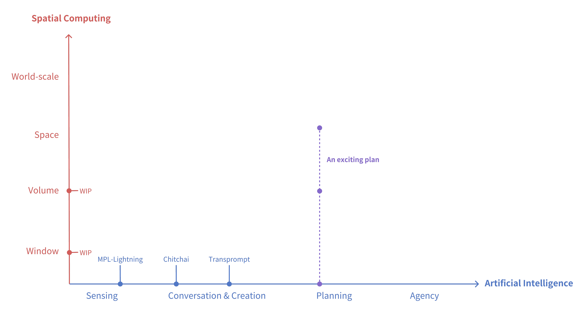

### Hi there 👋

I'm currently working on LLM and AIGC applications.

Previously, I learned Computer Graphics, Visualization and Differentiable Rendering.

For fun, I am exploring fusing artificial intelligence with spatial computing. And we have some plans!

Below is the map of projects I am trying to explore. Stay tuned! Or join me 🚀

BTW, I post blogs on [reify.ing](https://reify.ing). Come and check it out!